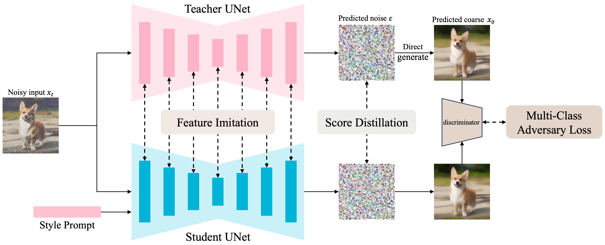

# DMM: Building a Versatile Image Generation Model via Distillation-Based Model Merging

<div style="text-align: center;">
  <a href="https://arxiv.org/abs/2504.12364"></a>
</div>


Official repository of our paper [Building a Versatile Image Generation Model via Distillation-Based Model Merging](https://arxiv.org/abs/2504.12364).


## Introduction

we propose a score distillation based model merging paradigm **DMM**, compressing multiple models into a single versatile T2I model.



## Visualization


## Usage

Install required packages with:

```bash
pip install -r requirements.txt
```

and initialize an Accelerate environment with:

```bash
accelerate config
```

An example of a training launch is in `train.sh`:

```bash
sh train.sh
```

An example of inference script is in `inference.py`:

```bash
python inference.py
```

## TODO
- [x] Pre-training code.
- [ ] Model weight release.
- [ ] Incremental training code.
- [x] Inference code with Diffusers.
- [ ] Journeydb dataset code.
- [ ] Online demo.
- [ ] ComfyUI plugins.